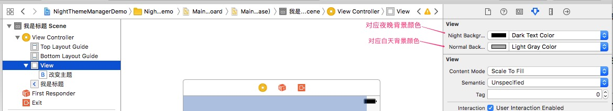

# NightThemeManager


  

黑夜模式的简单实现,利用`Objective-C`分类进行对应属性绑定

### 导入
将项目中`NightThemeManager `文件夹拖到项目里 

或者使用`Pod`安装

	pod 'SINightThemeManager', '~> 0.1.0'	
	
### 使用
1. 导入头文件

	```objective-c
	#import "NightThemeManager.h"
	```
	
2. 通过代码设置或者Xib设置不同主题的属性

	```objective-c
	self.view.nightBackgroundColor = [UIColor blackColor];
   self.view.normalBackgroundColor = [UIColor whiteColor];
	```
	
	通过xib设置如下图所示:
	
	
3. 设计好相应的颜色后,调用下面方法改变主题

	```objective-c
	[SINightThemeManager changeTheme] ;
	```
	
4. 改变某个`UIView`子类对象的主题

	首先需要实现下面这个非正式协议:
	
	```objective-c
	@protocol SINightThemeProtocol <NSObject>

	- (void)themeChange ;
	- (void)themeChangeWithDuration:(NSTimeInterval)duration ;
	- (NSArray *)subviews ;

	@end
	```
	
	调用下面这个方法进行改变:
	
	```objective-c
	+ (void)changeTheme:(UIView* )view ;
	+ (void)changeTheme:(UIView* )view withDuartion:(NSTimeInterval)duration ;
	```
	
5. 发送的通知
	
	```objective-c
	FOUNDATION_EXTERN NSString *const SINightThemeChangeNotification ;  // 将要改变主题
	FOUNDATION_EXTERN NSString *const SINightFallingNotification ;  // 将要变为黑夜主题
	FOUNDATION_EXTERN NSString *const SIDawnComingNotification ;  // 将要变为白天主题
	```
	
6. 通知携带着主题将要改变的主题和旧的主题信息,保存于userinfo字典中,字典对应的key如下

	```objective-c
	FOUNDATION_EXTERN NSString *const SINightThemeOldThemeKey ;  // 旧主题对应Key
	FOUNDATION_EXTERN NSString *const SINightThemeNewThemeKey ;  // 新主题对应Key
	```
	
	
### 要求
iOS 7 or later.
	
## NightThemeManager
NightThemeManager is available under the MIT license. See the LICENSE file for more info.
	


